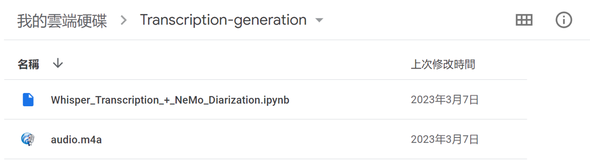
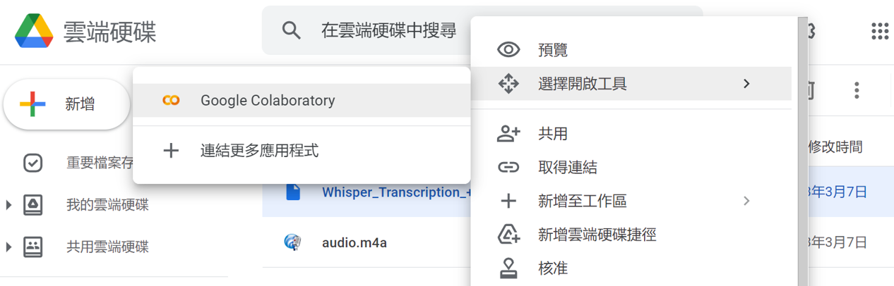
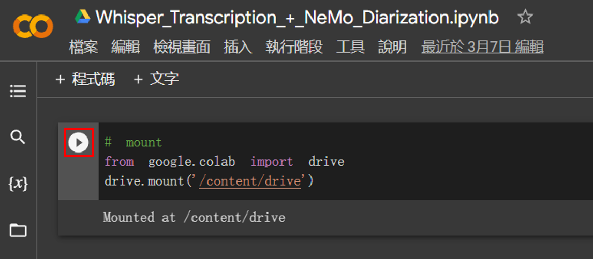
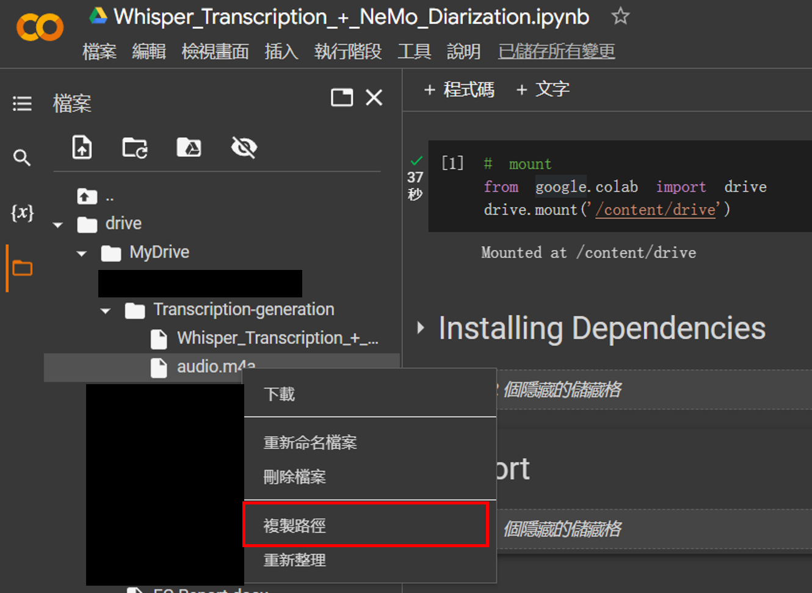
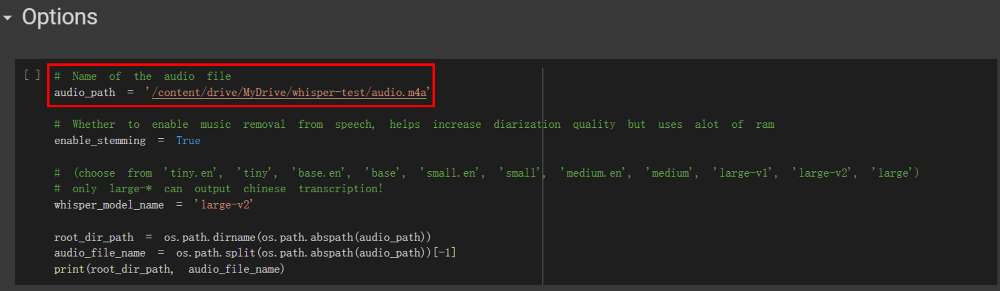
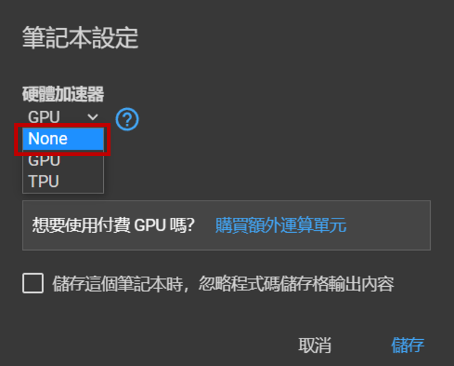
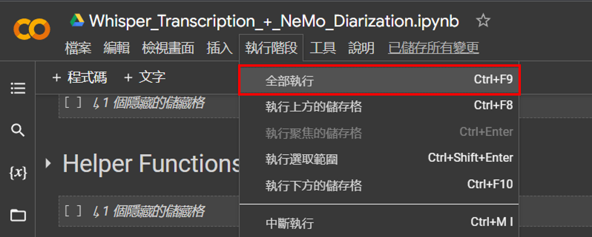

# 逐字稿產生 & 語者辨識

* 逐字稿 (Transcription)  
Model: Whisper [ref](https://github.com/openai/whisper)
* 語者辨識 (Speaker Diarization)  
Model: NeMo [ref](https://github.com/NVIDIA/NeMo)

---

## 使用步驟
Step 1: 在 Google drive 上建立目錄  
  
Step 2: 上傳 .ipynb 檔和音檔 (放在同個資料夾內)
  
  

Step 3: 使用 Google Colab 打開 .ipynb 檔  

  

Step 4: 將 Google drive 掛載至目前工作區  

  

Step 5: 複製音檔位置

  

Step 6: 並且貼上到程式中

  

Step 7: 設定執行環境 (關閉 gpu)  

    
  

Step 8: Run all  

  

Step 9: 在程式執行結束後，結果會存入 Google drive 的資料夾內  
  
  
## 執行時間測試

TODO
